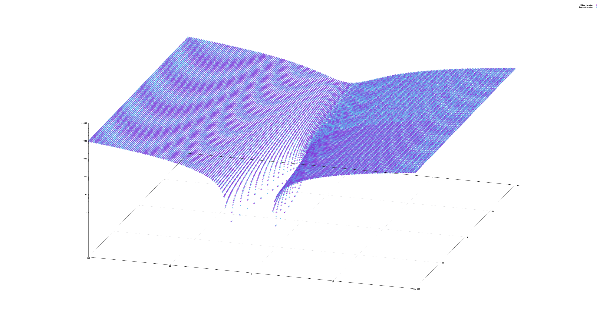

# Genetic Programming

Based on chapter eleven of the book Programming Collective Intelligence.

## Sample run

In this run an optimial expression was found in less than a thousand generations


The x-axis is represents the generation and y-axis represents the score. The
score is better as it approaches zero. In this run the score of the winning
expression was 9.57E-12.

The task is to discover the function:

```
x**2 + 2 * y + 3 * x + 5
```

The expression yielded was

```kotlin
Add(Add(Add(Mul(Param("x"), Param("x")), Add(Param("x"), Param("y"))), Add(Add(Param("x"), Add(Gt(Mul(Param("x"), Param("y")),If(Mul(If(Gt(Param("y"),Param("y")), Gt(Const(0.19461961582865006),Const(0.4055039316155936)), Param("y")), Sub(Gt(Const(0.875451443202543),Param("x")), Param("x"))), Gt(Mul(Const(0.12025225441289078), Const(0.11970683002894345)),Param("y")), If(Param("x"), Const(0.5347030795768023), Const(0.15515739996369393)))), Param("y"))), Param("x"))), Add(Add(Gt(Const(0.4858039982862735),Sub(Const(0.15187656831984542), Param("x"))), Gt(Const(0.8825479234040398),Const(0.7533698766486537))), Add(Gt(Add(Const(0.9526475953120076), Const(0.42252085669747863)),Const(0.8825479234040398)), Gt(Param("y"),Sub(Gt(Param("x"),Param("y")), Const(0.7914566521846355))))))
```

The expression toString method produces valid Kotlin code.

The plot below compares the values evaluating the hidden function and the
expression above. The axis x and y are the input of the functions and the z axis
is the output.



## Setup

```bash
# examples
./gradlew run -q --args='examples'

# learning mode
./gradlew run -q --args='learning'

# compare hidden function against learned expression
./gradlw run -q --args='compare'
```
