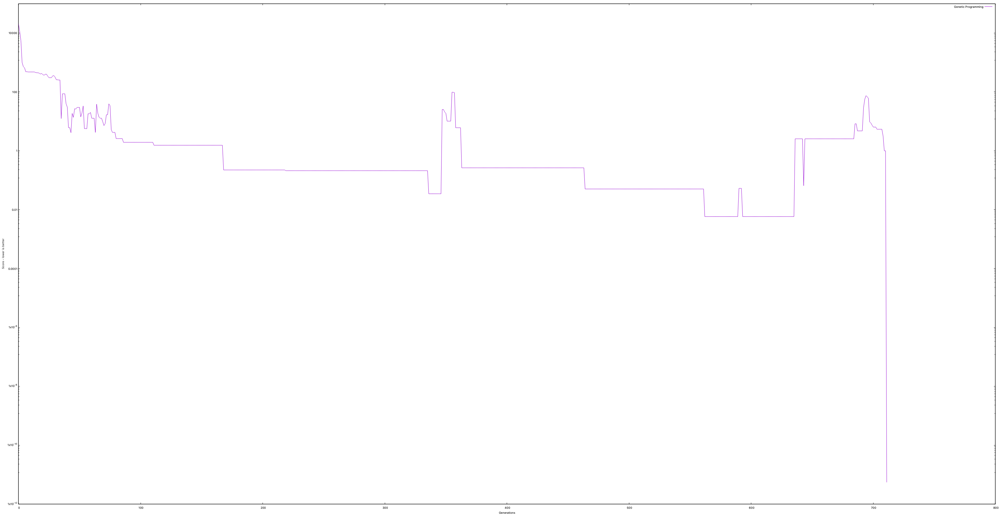

# Genetic Programming

Based on chapter 11 of the book Programming Collective Intelligence.

## Sample run

In this run the population was set to 1k and 10k generations.



The task is to discover the function:

```
x**2 + 2 * y + 3 * x + 5
```

The expression yielded was

```
(( 0.8304631131471493  +  0.8333408868711532 ) + ((((((( 0.5451961050671689  + (if ( Context[y]  >  Context[y] ) 1.0 else 0.0)) + (( Context[x]  * (if ( 0.9417800340873351  > 0.0) {  Context[x]  } else { (if ( Context[y]  > 0.0) { (if (( Context[x]  +  Context[x] ) > 0.0) {  0.7067047558997694  } else { (if ((if ((if ((if ( Context[y]  > 0.0) {  Context[y]  } else { (( Context[y]  -  0.8095091346235621 ) +  0.905213171309831 ) }) >  Context[y] ) 1.0 else 0.0) >  0.20350888649813792 ) 1.0 else 0.0) > 0.0) { (( Context[y]  *  0.7689390992611634 ) * (if ( 0.9256184582840955  > 0.0) { ((if ( Context[y]  > 0.0) {  0.24788624930942094  } else {  0.41487596587099984  }) * (if ( 0.6369077188452328  > 0.0) {  Context[x]  } else {  Context[x]  })) } else {  Context[y]  })) } else {  Context[x]  }) }) } else {  0.13579980426446758  }) })) + ((( Context[y]  +  Context[x] ) -  Context[y] ) + ( 0.2700341708631939  *  2.890804994429841E-4 )))) + ( Context[y]  + (if ( Context[y]  > 0.0) {  Context[y]  } else {  0.4181422619078603  }))) + ( 0.9575814042156403  +  Context[x] )) +  Context[x] ) + (if ( Context[x]  > (( 0.8928274715875624  -  0.8578502752830313 ) -  0.550369515794871 )) 1.0 else 0.0)) +  0.8333408868711532 ))
```

## Setup

```bash
./gradlew run
```
